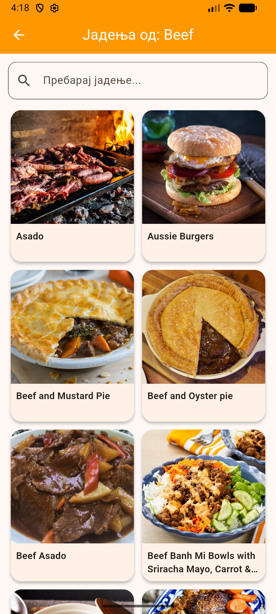
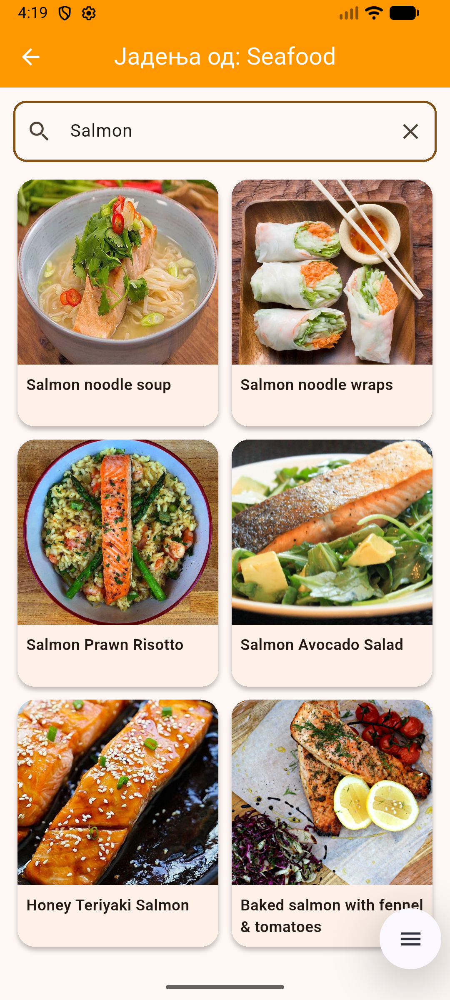
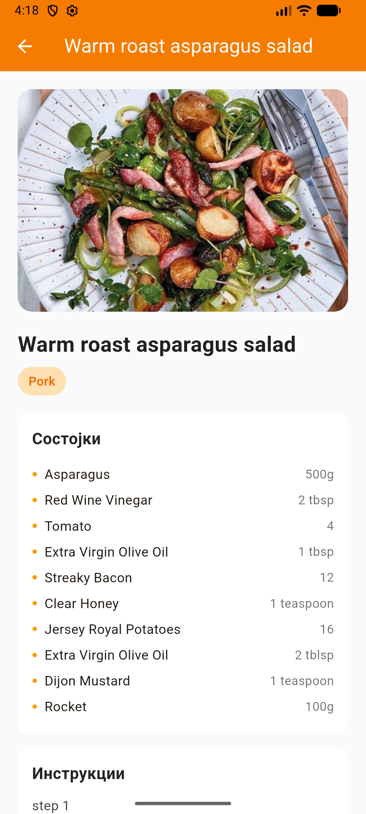
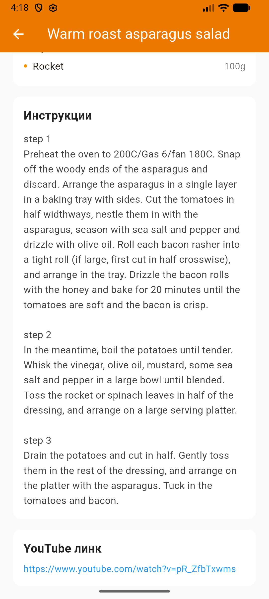
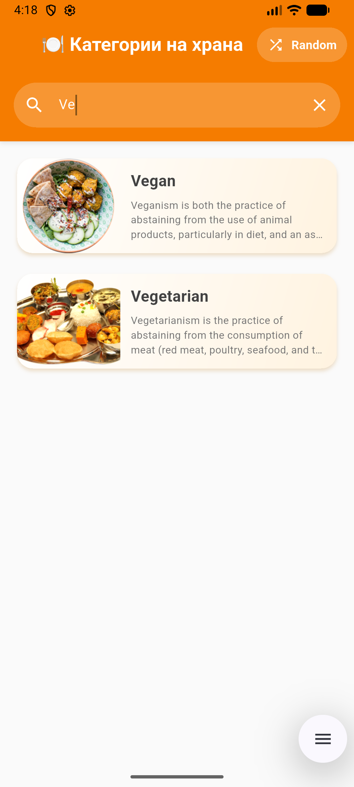
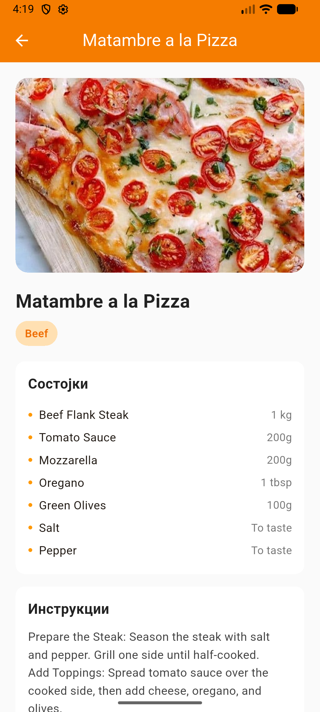
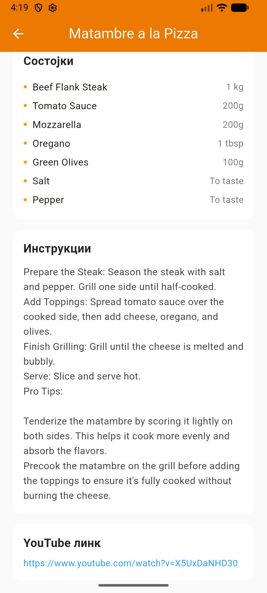

# recipe_app

Laboratory task 2 for course Mobile Information Systems

Author: Dragana Usovikj 221043

The video demo and the screenshots are also available in folder ``videoAndSS``
# Video demo
https://github.com/user-attachments/assets/16e938a5-8ad4-4529-af61-c8fbd398b44a

# Screenshots

  
  
  
  
  
  
  
  

