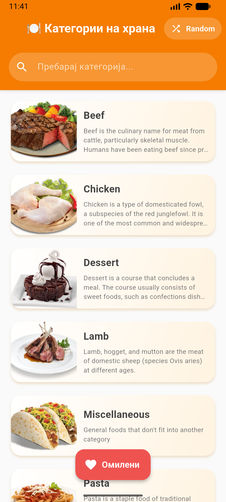
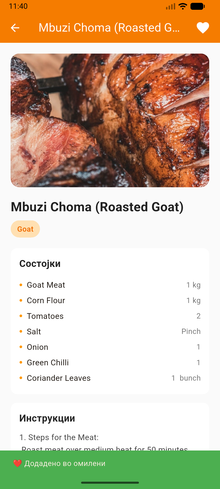
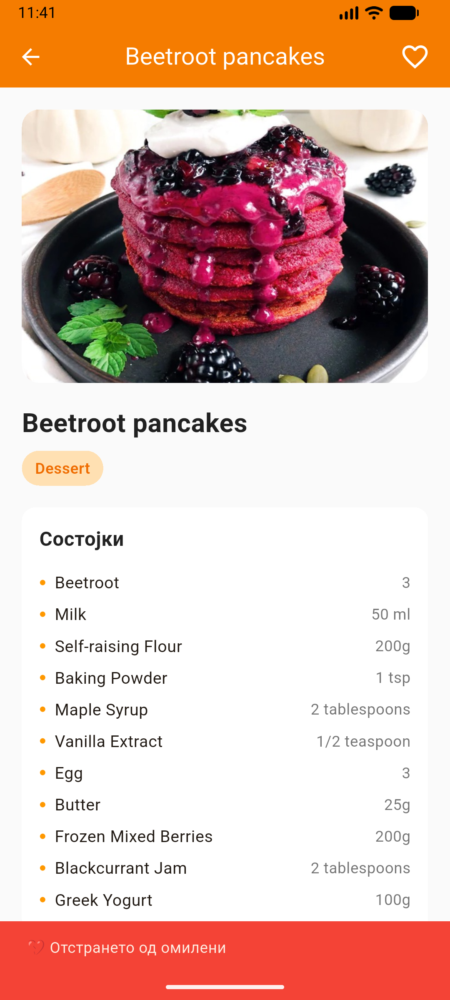
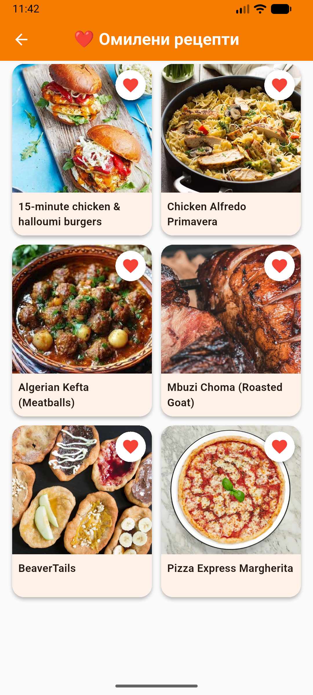
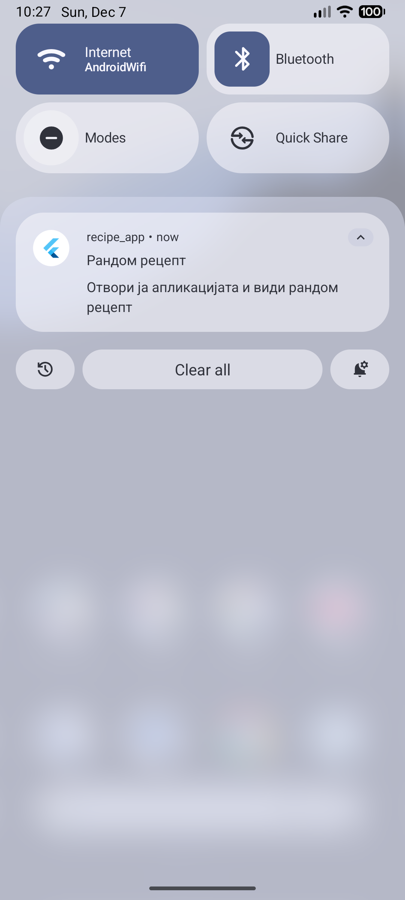
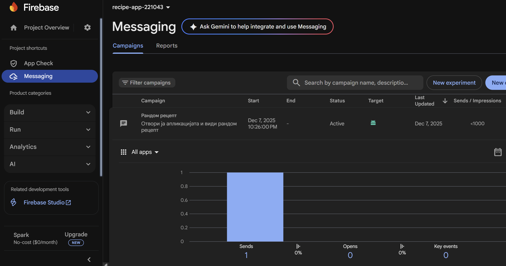

# recipe_app

Laboratory task 2 and 3 for course Mobile Information Systems

Author: Dragana Usovikj 221043

The video demo and the screenshots are also available in folder ``videoAndSS``  
The screenshots from laboratory 3 are in folder ``videoAndSS/lab3``  
The notification for reminding the user to view a random recipe is scheduled to be sent daily at 10:26 pm.

# Video demo from lab 2
https://github.com/user-attachments/assets/16e938a5-8ad4-4529-af61-c8fbd398b44a

# Screenshots from lab 2

  
  
  
  
  
  
  
  

# Screenshots from lab 3

  
  
  
  
  
  

